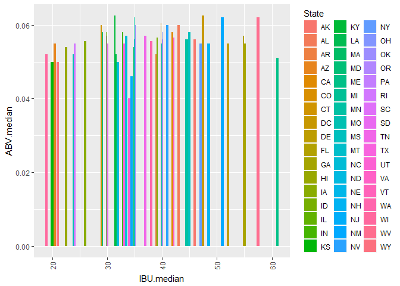
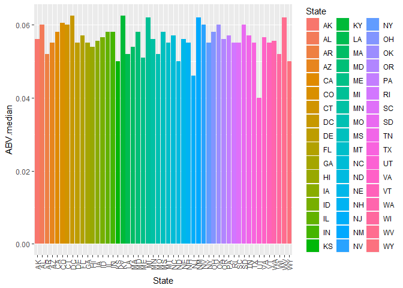
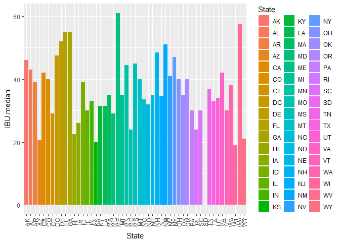
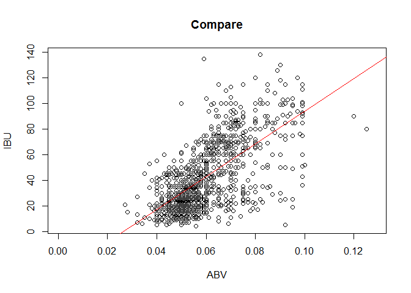

Introduction:
=============

Todays, due to variaty of beers and brew styles, beer selection is not simple any more. Craft beers have an enormous positive impact on the economy. Craft brewing industry in the U.S. created more than 424,000 jobs and contributed $56 billion to the U.S. economy.
In this research, there are answers to common questions regarding craft beers and breweries.

Import .csv data sets:
======================

This is the first step to execute analysis. there are two .csv files
received which are used in our reserach.

    Beers <- read.csv(file="C:/Users/R900255/Desktop/Uni/Doing DS/Beers.csv")
    Breweries <- read.csv(file="C:/Users/R900255/Desktop/Uni/Doing DS/Breweries.csv")

Before starting any research, it is important to understand available
sources, columns and information. and clean data sets if needed. Beers
dataset contains a list of 2410 US craft beers and 7 columns of data and
Breweries dataset contains 558 US breweries and 4 columns of data. The
datasets descriptions and columns included are as follows:

Beers.csv: 
Name: Name of the beer. 
Beer ID: Unique identi er of the
beer. 
ABV: Alcohol by volume of the beer.
IBU: International Bitterness Units of the beer. 
Brewery ID: Brewery id associated with the beer.
Style: Style of the beer. Ounces: Ounces of beer.

Breweries.csv: 
Brew ID: Unique identi er of the brewery. 
Name: Name of the brewery. 
City: City where the brewery is located. 
State: State where the brewery is located.

    names(Beers)

    ## [1] "Name"       "Beer_ID"    "ABV"        "IBU"        "Brewery_id"
    ## [6] "Style"      "Ounces"

    dim(Beers)

    ## [1] 2410    7

    names(Breweries)

    ## [1] "Brew_ID" "Name"    "City"    "State"

    dim(Breweries)

    ## [1] 558   4

1. The number of breweries present in each state:
=================================================

This study shows that the number of breweries present in different
states are different. CO has the maximum number of breweries.

1 AK 7 2 AL 3 3 AR 2 4 AZ 11 5 CA 39 6 CO 47 7 CT 8 8 DC 1 9 DE 2 10 FL
15 11 GA 7 12 HI 4 13 IA 5 14 ID 5 15 IL 18 16 IN 22 17 KS 3 18 KY 4 19
LA 5 20 MA 23 21 MD 7 22 ME 9 23 MI 32 24 MN 12 25 MO 9 26 MS 2 27 MT 9
28 NC 19 29 ND 1 30 NE 5 31 NH 3 32 NJ 3 33 NM 4 34 NV 2 35 NY 16 36 OH
15 37 OK 6 38 OR 29 39 PA 25 40 RI 5 41 SC 4 42 SD 1 43 TN 3 44 TX 28 45
UT 4 46 VA 16 47 VT 10 48 WA 23 49 WI 20 50 WV 1 51 WY 4

    Brew.per.State  <- aggregate(rep(1, length(paste0(Breweries$State))),
                                 by=list(Breweries$State), sum)
    Brew.per.State

    ##    Group.1  x
    ## 1       AK  7
    ## 2       AL  3
    ## 3       AR  2
    ## 4       AZ 11
    ## 5       CA 39
    ## 6       CO 47
    ## 7       CT  8
    ## 8       DC  1
    ## 9       DE  2
    ## 10      FL 15
    ## 11      GA  7
    ## 12      HI  4
    ## 13      IA  5
    ## 14      ID  5
    ## 15      IL 18
    ## 16      IN 22
    ## 17      KS  3
    ## 18      KY  4
    ## 19      LA  5
    ## 20      MA 23
    ## 21      MD  7
    ## 22      ME  9
    ## 23      MI 32
    ## 24      MN 12
    ## 25      MO  9
    ## 26      MS  2
    ## 27      MT  9
    ## 28      NC 19
    ## 29      ND  1
    ## 30      NE  5
    ## 31      NH  3
    ## 32      NJ  3
    ## 33      NM  4
    ## 34      NV  2
    ## 35      NY 16
    ## 36      OH 15
    ## 37      OK  6
    ## 38      OR 29
    ## 39      PA 25
    ## 40      RI  5
    ## 41      SC  4
    ## 42      SD  1
    ## 43      TN  3
    ## 44      TX 28
    ## 45      UT  4
    ## 46      VA 16
    ## 47      VT 10
    ## 48      WA 23
    ## 49      WI 20
    ## 50      WV  1
    ## 51      WY  4

2. Merge beer data with breweries data by brewery id:
=====================================================

Print frst 6 observations and the last six observations to check the
merged file.

In order to study available data, first checking the column names to
make sure that they are clear in meaning and to understand the
information included in each table. A key column in each table used to
joint tables.

Key column is "Brewery\_id" in Beers data set and "Brew\_ID"" in
Breweries data set. In order to have the same name for key columns in
both data sets, it needs to rename the "Brew\_ID" column to
"Brewery\_id" After renaming "Brew\_ID" column, the list of columns in
"Breweries" dataset update to: "Brewery\_id" "Name" "City" "State"

    colnames(Breweries)[colnames(Breweries)=="Brew_ID"]<-"Brewery_id"
    names(Breweries)

    ## [1] "Brewery_id" "Name"       "City"       "State"

    names(Beers)

    ## [1] "Name"       "Beer_ID"    "ABV"        "IBU"        "Brewery_id"
    ## [6] "Style"      "Ounces"

Now, it is time to merge data sets. A new object "BeerBrew" which is the
result of merging tables is created. The dimension of the "BeerBrew"
data frame is 2410 rows and 10 columns (combination of 6 Beers columns
and 4 Breweries columns). columns are as below: "Brewery\_id"
"Name.Beers" "Beer\_ID" "ABV"  
"IBU"  
"Style" "Ounces" "Name.Breweries" "City" "State"

in the merged file, top 6 rows and last 6 rows are as below:

Brewery\_id Name.Beers Beer\_ID ABV IBU Style Ounces Name.Breweries City
State 1 1 Get Together 2692 0.045 50 American IPA 16 NorthGate Brewing
Minneapolis MN 2 1 Maggie's Leap 2691 0.049 26 Milk / Sweet Stout 16
NorthGate Brewing Minneapolis MN 3 1 Wall's End 2690 0.048 19 English
Brown Ale 16 NorthGate Brewing Minneapolis MN 4 1 Pumpion 2689 0.060 38
Pumpkin Ale 16 NorthGate Brewing Minneapolis MN 5 1 Stronghold 2688
0.060 25 American Porter 16 NorthGate Brewing Minneapolis MN 6 1 Parapet
ESB 2687 0.056 47 Extra Special / Strong Bitter (ESB) 16 NorthGate
Brewing Minneapolis MN

    Brewery_id                Name.Beers Beer_ID   ABV IBU                   Style Ounces                Name.Breweries          City State

2405 556 Pilsner Ukiah 98 0.055 NA German Pilsener 12 Ukiah Brewing
Company Ukiah CA 2406 557 Heinnieweisse Weissebier 52 0.049 NA
Hefeweizen 12 Butternuts Beer and Ale Garrattsville NY 2407 557
Snapperhead IPA 51 0.068 NA American IPA 12 Butternuts Beer and Ale
Garrattsville NY 2408 557 Moo Thunder Stout 50 0.049 NA Milk / Sweet
Stout 12 Butternuts Beer and Ale Garrattsville NY 2409 557 Porkslap Pale
Ale 49 0.043 NA American Pale Ale (APA) 12 Butternuts Beer and Ale
Garrattsville NY 2410 558 Urban Wilderness Pale Ale 30 0.049 NA English
Pale Ale 12 Sleeping Lady Brewing Company Anchorage AK

    BeerBrew<- merge(x=Beers,y=Breweries, by= "Brewery_id",
                           all.x = TRUE, sort = TRUE, suffixes = c(".Beers", ".Breweries"),
                           allow.cartesian=getOption("datatable.allow.cartesian"))
    dim(BeerBrew)

    ## [1] 2410   10

    names(BeerBrew)

    ##  [1] "Brewery_id"     "Name.Beers"     "Beer_ID"        "ABV"           
    ##  [5] "IBU"            "Style"          "Ounces"         "Name.Breweries"
    ##  [9] "City"           "State"

    head(BeerBrew,6)

    ##   Brewery_id    Name.Beers Beer_ID   ABV IBU
    ## 1          1  Get Together    2692 0.045  50
    ## 2          1 Maggie's Leap    2691 0.049  26
    ## 3          1    Wall's End    2690 0.048  19
    ## 4          1       Pumpion    2689 0.060  38
    ## 5          1    Stronghold    2688 0.060  25
    ## 6          1   Parapet ESB    2687 0.056  47
    ##                                 Style Ounces     Name.Breweries
    ## 1                        American IPA     16 NorthGate Brewing 
    ## 2                  Milk / Sweet Stout     16 NorthGate Brewing 
    ## 3                   English Brown Ale     16 NorthGate Brewing 
    ## 4                         Pumpkin Ale     16 NorthGate Brewing 
    ## 5                     American Porter     16 NorthGate Brewing 
    ## 6 Extra Special / Strong Bitter (ESB)     16 NorthGate Brewing 
    ##          City State
    ## 1 Minneapolis    MN
    ## 2 Minneapolis    MN
    ## 3 Minneapolis    MN
    ## 4 Minneapolis    MN
    ## 5 Minneapolis    MN
    ## 6 Minneapolis    MN

    tail(BeerBrew,6)

    ##      Brewery_id                Name.Beers Beer_ID   ABV IBU
    ## 2405        556             Pilsner Ukiah      98 0.055  NA
    ## 2406        557  Heinnieweisse Weissebier      52 0.049  NA
    ## 2407        557           Snapperhead IPA      51 0.068  NA
    ## 2408        557         Moo Thunder Stout      50 0.049  NA
    ## 2409        557         Porkslap Pale Ale      49 0.043  NA
    ## 2410        558 Urban Wilderness Pale Ale      30 0.049  NA
    ##                        Style Ounces                Name.Breweries
    ## 2405         German Pilsener     12         Ukiah Brewing Company
    ## 2406              Hefeweizen     12       Butternuts Beer and Ale
    ## 2407            American IPA     12       Butternuts Beer and Ale
    ## 2408      Milk / Sweet Stout     12       Butternuts Beer and Ale
    ## 2409 American Pale Ale (APA)     12       Butternuts Beer and Ale
    ## 2410        English Pale Ale     12 Sleeping Lady Brewing Company
    ##               City State
    ## 2405         Ukiah    CA
    ## 2406 Garrattsville    NY
    ## 2407 Garrattsville    NY
    ## 2408 Garrattsville    NY
    ## 2409 Garrattsville    NY
    ## 2410     Anchorage    AK

3. The number of NA's in each column.
=====================================

Both Beers abd Breweries data sets have NA values in some of their
columns. the number of NA's in each columns are shown below:

In Beers data set, ABV column has 62 NA's and IBU column has 1005 NA's:
Name Beer\_ID ABV IBU Brewery\_id Style Ounces 0 0 62 1005 0 0 0

In Breweries data set, none of the columns has NA's: Brewery\_id Name
City State 0 0 0 0 In BeerBrew file, ABV column has 62 NA's and IBU
column has 1005 NA's: Brewery\_id Name.Beers Beer\_ID ABV IBU Style
Ounces Name.Breweries City State 0 0 0 62 1005 0 0 0 0 0

    colSums(is.na(Beers))

    ##       Name    Beer_ID        ABV        IBU Brewery_id      Style 
    ##          0          0         62       1005          0          0 
    ##     Ounces 
    ##          0

    colSums(is.na(Breweries))

    ## Brewery_id       Name       City      State 
    ##          0          0          0          0

    colSums(is.na(BeerBrew))

    ##     Brewery_id     Name.Beers        Beer_ID            ABV            IBU 
    ##              0              0              0             62           1005 
    ##          Style         Ounces Name.Breweries           City          State 
    ##              0              0              0              0              0

4. The median alcohol content and international bitterness unit for each state:
===============================================================================

First, two new files which are subset of BeerBrew data frame are
created. "IBUclean" and "ABVclean" do not include missing values of IBU
and ABV. it is required to ignore missing values for calculating
medians. ABVclean data frame includes 2348 rows and 10 columns. IBUclean
data frame includes 1405 rows and 10 columns.

    IBUclean<-subset(x=BeerBrew, ! is.na(IBU))
    ABVclean<-subset(x=BeerBrew, ! is.na(ABV))
    dim(ABVclean)

    ## [1] 2348   10

    dim(IBUclean)

    ## [1] 1405   10

The method used to calculate the medians of ABV and IBU per state in
this study required to install "doBy" package. IBUmedian file includes
IBU median per state by using IBUclean data frame. ABVmedian file also
includes ABV median per state by using ABVclean data frame. Then both
IBUmedian and ABVmedian files are merged to have calculated medians of
ABV and IBU in the same file "New".

    library(doBy)
    IBUmedian<-summaryBy(IBU~State, data=IBUclean,FUN=list(median), na.rm=F)
    ABVmedian<-summaryBy(ABV~State, data=ABVclean,FUN=list(median), na.rm=F)
    New<-merge(x=ABVmedian, y=IBUmedian, by="State", all=TRUE)
    dim(New)

    ## [1] 51  3

    names(New)

    ## [1] "State"      "ABV.median" "IBU.median"

    New

    ##    State ABV.median IBU.median
    ## 1     AK     0.0560       46.0
    ## 2     AL     0.0600       43.0
    ## 3     AR     0.0520       39.0
    ## 4     AZ     0.0550       20.5
    ## 5     CA     0.0580       42.0
    ## 6     CO     0.0605       40.0
    ## 7     CT     0.0600       29.0
    ## 8     DC     0.0625       47.5
    ## 9     DE     0.0550       52.0
    ## 10    FL     0.0570       55.0
    ## 11    GA     0.0550       55.0
    ## 12    HI     0.0540       22.5
    ## 13    IA     0.0555       26.0
    ## 14    ID     0.0565       39.0
    ## 15    IL     0.0580       30.0
    ## 16    IN     0.0580       33.0
    ## 17    KS     0.0500       20.0
    ## 18    KY     0.0625       31.5
    ## 19    LA     0.0520       31.5
    ## 20    MA     0.0540       35.0
    ## 21    MD     0.0580       29.0
    ## 22    ME     0.0510       61.0
    ## 23    MI     0.0620       35.0
    ## 24    MN     0.0560       44.5
    ## 25    MO     0.0520       24.0
    ## 26    MS     0.0580       45.0
    ## 27    MT     0.0550       40.0
    ## 28    NC     0.0570       33.5
    ## 29    ND     0.0500       32.0
    ## 30    NE     0.0560       35.0
    ## 31    NH     0.0550       48.5
    ## 32    NJ     0.0460       34.5
    ## 33    NM     0.0620       51.0
    ## 34    NV     0.0600       41.0
    ## 35    NY     0.0550       47.0
    ## 36    OH     0.0580       40.0
    ## 37    OK     0.0600       35.0
    ## 38    OR     0.0560       40.0
    ## 39    PA     0.0570       30.0
    ## 40    RI     0.0550       24.0
    ## 41    SC     0.0550       30.0
    ## 42    SD     0.0600         NA
    ## 43    TN     0.0570       37.0
    ## 44    TX     0.0550       33.0
    ## 45    UT     0.0400       34.0
    ## 46    VA     0.0565       42.0
    ## 47    VT     0.0550       30.0
    ## 48    WA     0.0555       38.0
    ## 49    WI     0.0520       19.0
    ## 50    WV     0.0620       57.5
    ## 51    WY     0.0500       21.0

Bar chart of median of ABV and IBU for each state:
==================================================

The bar chart is created by using "ggplot2" package and "new" file. The
first bar chart shows the ABV median versus IBU median and each bar
represent one state. the next bar chart is the ABV median versus state.
The last one is IBU median versus state.

    library(ggplot2)
    ggplot(data=New, aes(x=IBU.median, y=ABV.median, fill=State))+geom_bar(stat="identity",position=position_dodge())+theme(axis.text.x=element_text(angle=90,vjust=0.5))

    ## Warning: Removed 1 rows containing missing values (geom_bar).

    ggplot(data=New, aes(x=State, y=ABV.median, fill=State))+geom_bar(stat="identity",position=position_dodge())+theme(axis.text.x=element_text(angle=90,vjust=0.5))

    ggplot(data=New, aes(x=State, y=IBU.median, fill=State))+geom_bar(stat="identity",position=position_dodge())+theme(axis.text.x=element_text(angle=90,vjust=0.5))

    ## Warning: Removed 1 rows containing missing values (geom_bar).

5. Which state has the maximum alcoholic beer? Which state has the most bitter beer?
====================================================================================

BeerBrew data frame (the merge of Beers and Breweries data sets) is used
to find states with maximum ABV and IBU, as BeerBrew includes all state
column and IBU and ABV columns. CO has the maximum ABV of 0.128 and OR
has the maximum IBU of 138.

    BeerBrew[which.max(BeerBrew$ABV),]

    ##     Brewery_id                                           Name.Beers
    ## 375         52 Lee Hill Series Vol. 5 - Belgian Style Quadrupel Ale
    ##     Beer_ID   ABV IBU            Style Ounces          Name.Breweries
    ## 375    2565 0.128  NA Quadrupel (Quad)   19.2 Upslope Brewing Company
    ##        City State
    ## 375 Boulder    CO

    BeerBrew[which.max(BeerBrew$IBU),]

    ##      Brewery_id                Name.Beers Beer_ID   ABV IBU
    ## 1857        375 Bitter Bitch Imperial IPA     980 0.082 138
    ##                               Style Ounces          Name.Breweries    City
    ## 1857 American Double / Imperial IPA     12 Astoria Brewing Company Astoria
    ##      State
    ## 1857    OR

6. Summary statistics for ABV (Alcohol by volume) variable.
===========================================================

Basic statistics of ABV variable is calculated from "ABVclean" table as
the missing values of ABV is ignored in this table. Minimum = 0.00100 /
1st Qu. = 0.05000 / median = 0.05600 / mean = 0.05977 / 3rd Qu. =
0.06700 and maximum = 0.128

    summary(ABVclean$ABV)

    ##    Min. 1st Qu.  Median    Mean 3rd Qu.    Max. 
    ## 0.00100 0.05000 0.05600 0.05977 0.06700 0.12800

7. Relationship between the bitterness of the beer and its alcoholic content
============================================================================

By drawing a scatter plot of ABV versus IBU, it is obvious that there is
a positive correlation between ABV and IBU. The fit line has a positive
slope that indicates that with increasing ABV variable, IBU also
increased. that meand beers with higher alcoholic content tend to have
higher bitterness.

    plot(x=Beers$ABV,y=Beers$IBU,main="Compare",xlab="ABV", ylab="IBU")
    abline(lm(Beers$IBU~Beers$ABV), col="red")

